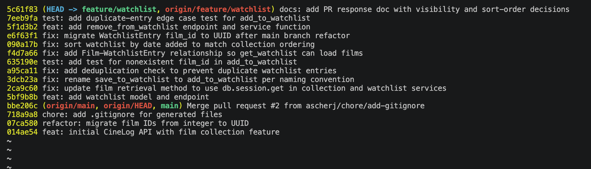

# PR Response Doc — CineLog Watchlist Feature

## AI Usage

I used an AI assistant throughout this project in the following specific ways:

- **Orientation.** Before reading the review comments, I had the AI summarize `models.py`, `collection_service.py`, and `test_collection.py` and explain how `add_to_collection()` handles deduplication and what it returns for a missing film. This let me see that the watchlist code was a rougher sibling of the already-accepted collection code, so most comments were "match the collection pattern." I verified each summary against the actual source.
- **Pattern-following code changes (Comments 1–3, dedup, remove_from_watchlist).** The AI helped implement changes that mirror existing patterns (the `add_to_*` rename, the `filter_by(...).first()` dedup check, the exception classes, the test structure). I verified every change by running `pytest` and a manual smoke script.
- **Rebase conflict (Comment 6).** The AI helped diagnose a non-obvious conflict: main's refactor had _deleted_ the `WatchlistEntry` class (which lived in the merge-base), so it silently vanished after the rebase. I confirmed the diagnosis with `git show`/pickaxe before re-adding the model with a UUID `film_id`.
- **Commit hygiene.** The AI helped confirm conventional-commit format and identify that one base commit ("added ... fixed a bug more changes") needed rewording, and that an edge-case test had been bundled into the wrong commit and should be split out.
- **Design decisions (Comments 4 & 5) — the reasoning is mine.** I made both calls myself (keep `public=True`; switch to date-added). The AI laid out the CineLog-specific tradeoffs and drafted prose from _my_ chosen positions, but the positions and the reasoning about CineLog's users are my own.

## Comment 1 — Rename

**What I did:** Renamed `save_to_watchlist()` to `add_to_watchlist()` in `services/watchlist_service.py` to match the `add_to_*` naming convention already established by `add_to_collection()` in the collection service. The `save_` prefix was the only verb in the service layer that broke the pattern.

**How I verified:** Used a project-wide search (`grep -rn "save_to_watchlist" --include="*.py" .`) to find every reference before renaming. There were three: the function definition plus an import and a call site, both in `routes/watchlist/watchlist.py`. After updating all three I re-ran the same search to confirm zero remaining references, imported the app + blueprint to confirm nothing broke at import time, and ran `pytest tests/` (4 passed).

## Comment 2 — Deduplication

**What I did:** Followed the pattern `add_to_collection()` already uses. Added an `AlreadyInWatchlistError` exception to `services/watchlist_service.py` (mirroring `AlreadyInCollectionError`), and in `add_to_watchlist()` I query for an existing `WatchlistEntry` with the same `user_id`/`film_id` before inserting; if one exists I raise `AlreadyInWatchlistError` instead of silently creating a second row. I also wired `routes/watchlist/watchlist.py` to catch it and return HTTP 409, matching how the collection route responds. While there, I made the route catch `FilmNotFoundError` → 404 as well — the route already imported that exception but never used it, so a missing film previously produced a 500. Catching both keeps the watchlist endpoint's error contract identical to the collection endpoint's.

**How I verified:** I referenced `add_to_collection()` to confirm the dedup check queries `filter_by(user_id=..., film_id=...).first()` and raises before commit. Then I ran a smoke script against an in-memory DB: added a film (succeeded), added the same film again (raised `AlreadyInWatchlistError`), confirmed the table still held exactly one row, and confirmed a nonexistent film raised `FilmNotFoundError`. Full `pytest tests/` still passes (4 tests). Comment 3 adds a permanent regression test for the missing-film path.

## Comment 3 — Missing test

**What I did:** Created `tests/test_watchlist.py` and wrote `test_add_to_watchlist_nonexistent_film_raises`, the watchlist equivalent of `test_add_to_collection_nonexistent_film_raises`. I reused the exact fixture structure from `tests/test_collection.py` — the `app` fixture (in-memory SQLite, `db.create_all()` / `db.drop_all()` teardown), plus `sample_user` and `sample_film` — so the two test modules stay consistent. The test asserts that adding a film_id with no matching `Film` row raises `FilmNotFoundError` rather than a database integrity error.

**How I verified:** Ran `pytest tests/test_watchlist.py -v` (1 passed) and the full `pytest tests/ -v` (5 passed). Note: the fake film_id is an integer here to match `Film.id` on this pre-refactor branch; the Comment 6 UUID rebase updates it to a UUID string so the test still exercises a genuinely-nonexistent id.

## Comment 4 — Default visibility

**My position:** Keep `public=True` as the default for `WatchlistEntry`.

**Reasoning:** CineLog is a _community_ film-tracking app — its whole value is social. The payoff of a watchlist isn't just personal bookkeeping; it's "my friend also wants to see this," recommendations, and watch-parties. Because the large majority of users never change a default setting, a private-by-default watchlist would leave those community features effectively empty at signup — the network effect that makes the app worth using would never get off the ground. Public-by-default optimizes for discovery: a new user's "want to watch" list contributes to the shared graph immediately, without them having to opt in.

**Tradeoff acknowledged:** A watchlist is different from a collection. A collection is a curated record of films you _have_ watched — a badge of taste you've chosen to display. A watchlist is intent about films you _haven't_ watched yet, which some users treat as more private (a guilty-pleasure pick, something they're not ready to admit interest in). Public-by-default can therefore surprise a privacy-conscious user who saved something they'd rather keep to themselves. I don't think that kills the default, but it does mean the default shouldn't be a trap: it should be paired with a visible per-entry visibility toggle (the stretch feature) so the common case is served automatically while the minority can opt out. A default is a starting point, not a lock.

## Comment 5 — Sort order

**My position:** Switch `get_watchlist()` from alphabetical to date-added (newest first), matching `get_collection()`. (Implemented + covered by `test_get_watchlist_returns_newest_first`.)

**Reasoning:** Two reasons. First, consistency is real value _here specifically_: a user experiences collection and watchlist as two halves of one mental model — "films I've seen" and "films I want to see." If two lists that look identical sort by different rules, the user has to re-learn the interface on each screen for no benefit. Second, date-added actually fits the watchlist's job better than alphabetical does. People add to a watchlist in bursts of impulse — a friend recommends something, you save it — and when you open the app tonight to pick a film, you want that recent impulse near the top, not buried under alphabetical "A" titles.

**Engagement with reviewer's point:** The maintainer argued for date-added on consistency-with-collection grounds, and I agree — but I want to go past "consistency for its own sake," because consistency is only worth having when it doesn't fight the feature. Here it doesn't: recency-first is _also_ the better standalone default for a "want to watch" list. Alphabetical only wins when you're hunting a known title in a very long list, and a personal watchlist is usually short enough to scan. I considered exposing a `sort` parameter so callers could choose, but rejected it as over-engineering for the current scope — date-added is the right default, and a parameter can be added later if users actually ask for it.

## Comment 6 — Rebase

**What conflicted:** I created a backup branch (`backup/pre-rebase`), then ran `git fetch origin` + `git rebase origin/main`. Two things collided:

1. **`.gitignore` (add/add).** `origin/main` had independently added its own `.gitignore` (commit `718a9a8`). Its version is a strict superset of mine — identical except it also ignores `.pytest_cache/`.
2. **The UUID migration.** The refactor on main (`07ca580`, "migrate film IDs from integer to UUID") changed `Film.id` and `CollectionEntry.film_id` to `String(36)`. The subtle part: `WatchlistEntry` lived in the _merge-base_ commit (`014ae54`), not in any of my feature commits — and the refactor **deleted the entire `WatchlistEntry` class** as part of the migration. So when my commits replayed onto main, they landed on a models.py with no `WatchlistEntry` at all. Git did not flag this as a text conflict because my commits only _use_ `WatchlistEntry`; none of them _define_ it. The result was a models.py that imported and referenced a class that no longer existed (`ImportError: cannot import name 'WatchlistEntry'`).

**How I resolved it:**

- **`.gitignore`:** took main's version (the superset) and `git rebase --skip`-ped my now-redundant `chore: add .gitignore` commit, since main already provides an equivalent-or-better one.
- **UUID:** re-added the `WatchlistEntry` model to models.py with `film_id = db.Column(db.String(36), db.ForeignKey("film.id"))` — a UUID foreign key matching main's `Film.id`, instead of the old `db.Integer`. I also updated the now-stale `film_id (int)` docstring in `add_to_watchlist()`, the `Body: { "film_id": <int> }` note in the route, and the fake id in `test_add_to_watchlist_nonexistent_film_raises` (from the integer `999999` to a UUID string) so the test still targets a genuinely-nonexistent id. Committed as a single focused commit: `fix: migrate WatchlistEntry film_id to UUID after main branch refactor`.

**How I verified no conflict remains:** `grep` for conflict markers (`<<<<<<<`, `=======`, `>>>>>>>`) across all `.py`/`.md`/`.gitignore` — none. Confirmed the app imports (`python -c "import app; app.create_app()"`) and that `WatchlistEntry.film_id` is now `VARCHAR(36)`. Ran the full suite — 6 passed. Confirmed a linear history with no merge commits (`git log --oneline --merges origin/main..HEAD` is empty).

## Stretch Features

### remove_from_watchlist()

Added `remove_from_watchlist(user_id, film_id)` to `services/watchlist_service.py`, mirroring `remove_from_collection()`: it looks up the entry, raises a new `NotInWatchlistError` if the film isn't on the list, otherwise deletes it and returns `True`. Also added the matching `DELETE /watchlist/<user_id>/remove` route (returns 404 on `NotInWatchlistError`), so the endpoint surface matches the collection blueprint. Covered by two tests: `test_remove_from_watchlist_deletes_entry` (happy path) and `test_remove_from_watchlist_not_present_raises` (error path).

### Extra edge-case test

Added `test_add_to_watchlist_duplicate_raises`. The review (Comment 3) only asked for a nonexistent-film test, which exercises the `FilmNotFoundError` path. I chose the duplicate-add case because deduplication is the substance of Comment 2, yet nothing locked in its _happy-path_ behavior — that adding the same film twice raises `AlreadyInWatchlistError` and leaves exactly one row. Without this test, a future refactor could silently reintroduce duplicate entries and the suite would stay green. It's the watchlist mirror of `test_add_to_collection_duplicate_raises`.

## Git History (screenshot)



Text version for reference (feature commits, newest first — all conventional, no merge commits):

```
5c61f83 docs: add PR response doc with visibility and sort-order decisions
7eeb9fa test: add duplicate-entry edge case test for add_to_watchlist
5f1d3b2 feat: add remove_from_watchlist endpoint and service function
e6f63f1 fix: migrate WatchlistEntry film_id to UUID after main branch refactor
090a17b fix: sort watchlist by date added to match collection ordering
f4d7a66 fix: add Film-WatchlistEntry relationship so get_watchlist can load films
635190e test: add test for nonexistent film_id in add_to_watchlist
a95ca11 fix: add deduplication check to prevent duplicate watchlist entries
3dcb23a fix: rename save_to_watchlist to add_to_watchlist per naming convention
2ca9c60 fix: update film retrieval method to use db.session.get in collection and watchlist services
5bf9b8b feat: add watchlist model and endpoint
```

## PR Description

### What this feature does

Adds a **watchlist** to CineLog — a per-user list of films a user wants to watch (distinct from the collection, which is films already watched). Endpoints:

- `GET /watchlist/<user_id>` — return the user's watchlist, newest-added first.
- `POST /watchlist/<user_id>/add` — add a film (`{ "film_id": "<uuid>" }`); 404 if the film doesn't exist, 409 if it's already on the list.
- `DELETE /watchlist/<user_id>/remove` — remove a film (`{ "film_id": "<uuid>" }`); 404 if it isn't on the list.

The service layer (`add_to_watchlist`, `remove_from_watchlist`, `get_watchlist`) follows the same conventions as the collection service — `add_to_*` naming, service-level deduplication, and dedicated exceptions (`AlreadyInWatchlistError`, `NotInWatchlistError`).

### Design decisions

1. **Default visibility (`public=True`)** — new watchlist entries are public by default to support CineLog's community/discovery features. See Comment 4 above for the full reasoning and the acknowledged privacy tradeoff.
2. **Sort order (date-added, newest first)** — `get_watchlist()` sorts by `date_added` descending to stay consistent with `get_collection()` and to surface recently-added films first. See Comment 5.

### How to manually test

```bash
# 1. Set up and run
python -m venv .venv && source .venv/bin/activate
pip install -r requirements.txt
python app.py                     # serves at http://127.0.0.1:5000

# 2. In a second terminal, seed a user + film with a Python shell:
python - <<'PY'
from app import create_app, db
from models import User, Film
app = create_app()
with app.app_context():
    u = User(username="ada", email="ada@example.com"); db.session.add(u)
    f = Film(title="Arrival", year=2016, genre="Sci-Fi"); db.session.add(f)
    db.session.commit()
    print("USER_ID:", u.id)
    print("FILM_ID:", f.id)
PY

# 3. Exercise the endpoints (substitute the printed ids):
curl -X POST http://127.0.0.1:5000/watchlist/<USER_ID>/add \
     -H "Content-Type: application/json" -d '{"film_id": "<FILM_ID>"}'      # 201
curl -X POST http://127.0.0.1:5000/watchlist/<USER_ID>/add \
     -H "Content-Type: application/json" -d '{"film_id": "<FILM_ID>"}'      # 409 duplicate
curl http://127.0.0.1:5000/watchlist/<USER_ID>                              # list, newest first
curl -X DELETE http://127.0.0.1:5000/watchlist/<USER_ID>/remove \
     -H "Content-Type: application/json" -d '{"film_id": "<FILM_ID>"}'      # 200 removed

# 4. Run the test suite
pytest tests/ -v                  # 9 passed
```
